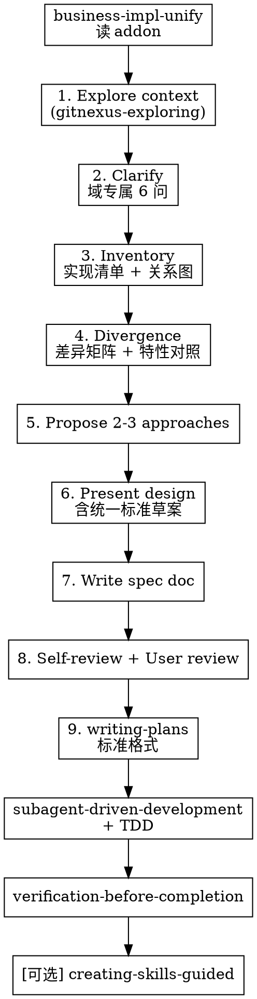

# business-impl-unify 重构设计：Superpowers Brainstorming 域扩展

**日期：** 2026-06-20  
**状态：** 待用户 review  
**范围：** 将 `business-impl-unify` 从独立六阶段流水线重构为 Superpowers brainstorming 的薄入口 + 域扩展  
**仓库：** `xiaozhi93/agent-skills`

---

## 1. 背景与问题

### 1.1 现状

`business-impl-unify` 当前是独立的六阶段流水线：

```
Phase 1 对齐边界 → Phase 2 探索盘点 → Phase 3 对比定标
→ Phase 4 TDD 收敛 → Phase 5 验证 → Phase 6 配套 Skill
```

Phase 4–5 实质上已在调用 Superpowers（`test-driven-development`、`subagent-driven-development`、`verification-before-completion`），与 Superpowers 标准链路存在重复：

```
brainstorming → spec doc → writing-plans → subagent-driven-development
```

### 1.2 目标

1. **保留** `business-impl-unify` 作为显式触发的薄入口（用户选 A）
2. **并入** Superpowers brainstorming 流程，而非平行维护六阶段
3. **域扩展** 仅在 brainstorming 中增加「实现盘点 + 差异对比」两步（澄清后、提方案前）
4. **产出** 标准 spec → 标准 writing-plans → 子代理驱动实现 → 验证
5. **Phase 6 可选**（用户选 B）：仅当用户明确要求时 invoke `creating-skills-guided`
6. **不扩展** writing-plans（用户选 A）：迁移策略写入 spec，plan 走 Superpowers 默认格式

### 1.3 非目标

- 修改 Superpowers 插件内的 `brainstorming/SKILL.md` 本体
- 删除 `templates/` 或 examples
- 将 `creating-skills-guided` 写入 manifest `requires`（降为可选）

---

## 2. 设计决策摘要

| 问题 | 决策 |
|------|------|
| 入口形态 | **A** — 保留 `business-impl-unify` 薄入口 |
| Phase 6 配套 Skill | **B** — 可选，用户明确要求才走 |
| 盘点/差异时机 | **A** — 澄清之后、提 2–3 方案之前 |
| Plan 扩展 | **A** — 只扩展 spec，plan 走标准 `writing-plans` |
| 实现方案 | **方案 1** — 薄入口 + 单一 `brainstorming-addon.md` |

---

## 3. 架构

### 3.1 目录结构（重构后）

```
skills/business-impl-unify/
├── SKILL.md                          # 薄路由（~80 行）
├── extension/
│   └── brainstorming-addon.md        # 域扩展：澄清、盘点、差异、spec 章节、Red Flags
├── templates/
│   ├── divergence-report.md          # spec §3 模板
│   ├── standard-proposal.md          # spec §4 模板（含迁移策略表）
│   └── migration-plan.md             # 参考文档（内容并入 spec §4，plan 阶段只读 spec）
└── examples.md                       # 更新触发语与预期行为
```

**删除：** `phases/01-clarify.md` … `phases/06-skillify.md`

### 3.2 执行流程



步骤 3–4 是相对标准 brainstorming 的**唯一增量**；步骤 9 起完全走 Superpowers 标准链。

### 3.3 薄入口 SKILL.md 职责

1. **Announce** — `Using business-impl-unify → Superpowers brainstorming + impl-unify extension`
2. **路由** — 读 `extension/brainstorming-addon.md`，invoke `brainstorming`
3. **HARD-GATE（精简）**
   - 未读 addon 不得进入 brainstorming
   - spec 未批不得 invoke `writing-plans`
   - 迁移 ≥2 步不得 inline，必须 `subagent-driven-development`
   - 一次只收敛一个业务域
   - 未验证通过不得写配套 Skill
4. **When NOT to use** — 保留与 `repo-feature-distill`、`gitnexus-refactoring` 等分工表

保留 frontmatter：`disable-model-invocation: true`（显式触发）

---

## 4. brainstorming-addon.md 规格

### 4.1 注入 brainstorming 检查清单

在标准 brainstorming 流程中插入：

| 插入位置 | 内容 | 来源 |
|----------|------|------|
| Clarify 阶段 | 域专属 6 问 | 原 `phases/01-clarify.md` |
| Clarify 之后、Approaches 之前 | 实现盘点 | 原 `phases/02-explore.md` + `gitnexus-exploring` |
| 盘点之后、Approaches 之前 | 差异对比 | 原 `phases/03-standardize.md` 对比维度 |
| Write spec | 域必填章节 | `templates/` 三份 |
| 全程 | Red Flags + 技能路由 | 原 SKILL.md |

### 4.2 域专属澄清问题（一次一问）

1. **业务域** — 要统一的具体业务（如「订单创建」）
2. **范围类型** — 单仓多模块 / 跨多仓
3. **已知实现** — 用户是否已知多套实现位置
4. **Canonical 倾向** — 中立对比 / 以某套为基准演进
5. **成功标准** — 测试、接口一致、删除重复、团队认可
6. **排除项** — 不合并什么（遗留分支、实验代码等）

### 4.3 盘点与差异

**盘点清单（Phase 2 等价物）：**

- 每套实现的入口（API、组件、Handler）
- 核心文件（≤20/套）
- 外部依赖差异
- 与 out of scope 的边界
- 关系图（ASCII 或 mermaid）

**差异对比五维（Phase 3 等价物）：**

- 行为（输入/输出、边界、错误语义）
- 结构（分层、模块边界、命名）
- 依赖（框架、第三方库、配置）
- 测试（覆盖范围、类型）
- 运维（日志、监控、特性开关）

### 4.4 Red Flags（保留）

- 「很明显留 A 删 B，直接改」→ 回到差异对比，补 spec
- 「先合并再补测试」→ 回到 TDD
- 「顺便把支付也统一了」→ 回到澄清，一次一域
- 「≥2 步迁移主会话一口气改完」→ 必须 subagent-driven-development
- 「1:1 复制 A 覆盖 B」→ 禁止；行为对等、代码适配

---

## 5. Spec 文档结构

**路径：** `docs/superpowers/specs/YYYY-MM-DD-{business-domain}-impl-unify-design.md`

```markdown
# {业务域} 实现收敛 Spec

> **For agentic workers:** REQUIRED SUB-SKILL: subagent-driven-development (when migration steps ≥ 2)

## 1. 业务域简报
## 2. 实现清单
## 3. 差异报告              ← templates/divergence-report.md
## 4. 统一标准              ← templates/standard-proposal.md（含迁移策略表）
## 5. 架构与组件            ← 标准 brainstorming
## 6. 数据流与错误处理
## 7. 测试策略
## 8. 回滚方案
```

迁移步骤表写在 §4「迁移计划」中；`writing-plans` 从 spec 读取，按 Superpowers 默认格式拆任务，**不**扩展 writing-plans 技能本身。

**早停路径：** 用户说「只要报告不要改代码」→ spec 用户批准后停止，不 invoke `writing-plans`。

---

## 6. 执行链末端

| 阶段 | 技能 | 条件 |
|------|------|------|
| 设计 | `brainstorming` + addon | 用户显式触发 business-impl-unify |
| 写 plan | `writing-plans` | spec 用户批准 |
| 实现 | `subagent-driven-development` + `test-driven-development` | plan 中 ≥2 步；单步 trivial 可 inline |
| 验证 | `verification-before-completion` | 实现完成 |
| 配套 Skill | `creating-skills-guided` | **仅**用户明确要求 |

跨仓时：读写代码前将 Agent 移到对应 workspace。

---

## 7. Manifest 与文档同步

### 7.1 skills.manifest.json

```json
{
  "name": "business-impl-unify",
  "description": "统一同一业务多套实现（Superpowers brainstorming 域扩展）",
  "triggers": ["统一业务实现", "多套实现", "实现分叉", "收敛实现", "business-impl-unify"],
  "requires": [
    "brainstorming",
    "writing-plans",
    "gitnexus-exploring",
    "test-driven-development",
    "subagent-driven-development",
    "verification-before-completion"
  ]
}
```

### 7.2 需同步更新的文件

| 文件 | 变更 |
|------|------|
| `skills/business-impl-unify/SKILL.md` | 重写为薄入口 |
| `skills/business-impl-unify/extension/brainstorming-addon.md` | 新增 |
| `skills/business-impl-unify/phases/*` | 删除 |
| `skills/business-impl-unify/examples.md` | 更新预期行为 |
| `docs/dependencies.md` | requires 变更；creating-skills-guided 标可选 |
| `docs/dev-testing.md` | 更新触发语与验证清单 |
| `docs/skill-anatomy.md` | 参考示例增加「brainstorming 域扩展」模式 |

### 7.3 CI

无需修改 `validate-skills.js`。确保 SKILL.md 相对链接指向 `extension/` 与 `templates/` 下存在的文件。

---

## 8. 测试触发语

| 触发语 | 预期行为 |
|--------|----------|
| 「统一这个 monorepo 里订单的三套实现」 | Announce → 读 addon → invoke brainstorming → 域澄清 → 不直接改代码 |
| 「三套登录逻辑，先出差异报告和标准方案」 | 盘点 + 差异 → 2–3 方案 → spec → **停止** |
| 「标准方案可以，开始改」 | spec 已批 → writing-plans → ≥2 步则 subagent-driven-development |
| 「收敛完帮我写个 Skill」 | 验证通过后 → creating-skills-guided |

**验证清单：**

- [ ] Agent 引用 brainstorming + addon，不说「Phase 1–6」
- [ ] 澄清后、提方案前出现实现清单与差异矩阵
- [ ] spec 含域章节（清单、差异、统一标准）
- [ ] spec 未批不 invoke writing-plans
- [ ] 未要求时不自动进入 creating-skills-guided

---

## 9. Frontmatter（SKILL.md）

```yaml
---
name: business-impl-unify
description: >-
  Use when the user explicitly asks to unify multiple implementations of the
  same business domain. Routes into Superpowers brainstorming with impl-unify
  extension; produces spec → plan → subagent-driven convergence. Optional
  skill creation via creating-skills-guided.
category: deliver
tags: [workflow, code, architecture, refactoring]
disable-model-invocation: true
source: xiaozhi93/agent-skills
---
```

---

## 10. 实现任务概览（供 writing-plans 使用）

1. 新增 `extension/brainstorming-addon.md`（合并原 phases 01–03 + Red Flags）
2. 重写 `SKILL.md` 为薄入口
3. 删除 `phases/` 目录
4. 更新 `examples.md`
5. 更新 `skills.manifest.json`、`docs/dependencies.md`、`docs/dev-testing.md`
6. 运行 `node scripts/validate-skills.js` 与 `validate-manifest.js`

---

## 11. Spec Self-Review（内联完成）

| 检查项 | 结果 |
|--------|------|
| Placeholder / TBD | 无 |
| 内部一致性 | 决策摘要与架构、manifest、测试一致 |
| Scope | 单次重构 business-impl-unify，不涉及其他技能 |
| 歧义 | 早停路径、可选 Phase 6、≥2 步子代理规则已写明 |
