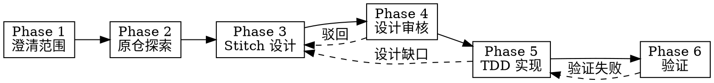

# App UI Redesign

从现有应用源码分析功能与 UI 结构，经 Stitch 完成重设计，用户审核通过后，在原仓库用 TDD 落地新 UI 代码。

## Overview

**核心原则：** 先对齐重设计范围与参考风格，再探索原仓、Stitch 设计、用户审核，最后 TDD 实现在原仓 feature 分支。

**产出：**

- Stitch 项目与屏幕设计
- 整 App 重设计 → 仓库内 `DESIGN.md`（或 `.stitch/DESIGN.md`）
- 原仓新 UI 代码 + 通过测试

**内嵌能力：**

- Phase 1 → `brainstorming`（创意前澄清）
- Phase 2 → `gitnexus-exploring`（可用时）或通用代码探索
- Phase 3 → Stitch MCP + 官方 stitch-skills（见 [reference/stitch-skills-map.md](reference/stitch-skills-map.md)）
- Phase 3 美学 → `frontend-design`
- Phase 5 → **强制** `test-driven-development`；多任务 → `subagent-driven-development` + `writing-plans`
- Phase 6 → `verification-before-completion`

**设计工具：** 仅 **Stitch MCP**（`user-stitch`）。不可用时不切换其他设计工具，按网络/API Key 排查。

## When to Use

- 用户有 Web / iOS / Android / React Native 等现有应用，希望**重设计 UI**
- 用户说「UI 重设计」「界面重做」「换皮」「用 Stitch 重新设计」「生成 DESIGN.md」
- 用户需要从源码提取功能 → 设计 → 原仓实现新界面

**When NOT to use:**

- 蒸馏 MVP 到新项目/换技术栈 → `app-distill`
- 仅微调样式、无 Stitch 设计流程 → `frontend-design`
- 原仓逻辑重构、非 UI → `gitnexus-refactoring`
- 创建 Agent Skill → `creating-skills-guided`

## Baseline Failures

| 失误 | 后果 |
|------|------|
| 跳过范围确认直接设计 | 范围膨胀或遗漏关键屏幕 |
| 跳过用户设计审核写代码 | 实现与预期不符、返工成本高 |
| 整 App 重设计无 DESIGN.md | 风格不一致、后续屏幕漂移 |
| 无 TDD 直接写 UI 代码 | 无法回归、质量不可验证 |
| 不用 stitch-skills 裸调 MCP | 流程混乱、遗漏设计系统步骤 |
| 未验证就宣告完成 | 交付不可构建或与设计稿不符 |

## Six-Phase Pipeline

| Phase | 模块 | 产出 | 门禁 |
|-------|------|------|------|
| 1 | [phases/01-clarify.md](phases/01-clarify.md) | 重设计简报 | 用户确认 → Phase 2 |
| 2 | [phases/02-explore.md](phases/02-explore.md) | 功能/UI 映射表 | 映射完成 → Phase 3 |
| 3 | [phases/03-design.md](phases/03-design.md) | Stitch 屏幕 + DESIGN.md（整 App） | 产出就绪 → Phase 4 |
| 4 | [phases/04-review.md](phases/04-review.md) | 用户审核记录 | **明确通过** → Phase 5 |
| 5 | [phases/05-implement.md](phases/05-implement.md) | 原仓新 UI 代码 | 测试绿 → Phase 6 |
| 6 | [phases/06-verify.md](phases/06-verify.md) | 验证报告 | 通过 → 完成 |

<HARD-GATE>
Do NOT enter Phase 2 until the user confirms redesign scope and references.
Do NOT enter Phase 3 until the feature/UI mapping is complete.
Do NOT enter Phase 4 until Stitch design artifacts are ready.
Do NOT enter Phase 5 until the user explicitly approves the design.
Do NOT write production UI code before a failing test exists (TDD).
Do NOT skip spec compliance review when using subagent-driven-development.
Do NOT declare completion until Phase 6 verification passes.
</HARD-GATE>

## Stitch Prerequisites

执行 Phase 3 前确认：

1. Stitch MCP（`user-stitch`）已启用且可 `list_projects`
2. 官方 stitch-skills 已安装（`~/.agents/skills/` 或项目 `.agents/skills/`）
3. 网络可达 `stitch.googleapis.com`（国内需 VPN/代理）

排查参考：用户文档 `docs/articles/cursor-google-stitch-ai-design.md`（若项目内有）。

## Execution Spine

1. **Announce:** "Using app-ui-redesign, starting Phase 1: Clarify."
2. **Phase 1** → 重设计简报 → **wait for approval**
3. **Phase 2** → 原仓探索 → 功能/UI 映射表
4. **Phase 3** → Stitch 设计 + DESIGN.md（整 App）→ 展示产出
5. **Phase 4** → 用户审核 → **wait for explicit approval**
6. **Phase 5** → feature 分支 + TDD + 子代理（多屏）→ 实现
7. **Phase 6** → 构建/测试/视觉验证 → 交付报告

## Quick Reference

| 用户说 | 动作 |
|--------|------|
| 「整个 App 换 UI」 | Phase 1 标记整 App；Phase 3 必须产出 DESIGN.md |
| 「只重做登录和首页」 | Phase 1 勾选屏幕；Phase 3 屏幕级设计即可 |
| 「参考这个 Dribbble 链接」 | Phase 1 记录参考；Phase 3 写入 Stitch prompt |
| 「直接写代码吧」 | 拒绝，回到 Phase 4 门禁 |
| 「Stitch 连不上」 | 排查网络/Key，不切换 Pencil 或其他工具 |
| 「RN 应用重设计」 | Phase 5 加载 `stitch-react-native` |

## Red Flags — STOP

- 「需求很清楚，直接设计/写代码」
- 「不用 DESIGN.md，看截图就行」
- 「跳过测试，先出界面」
- 「Stitch 太慢，换别的设计工具」
- 「设计差不多，先实现再说」

**出现以上任一，回到对应 Phase。**

## Additional Resources

- Stitch 技能路由：[reference/stitch-skills-map.md](reference/stitch-skills-map.md)
- DESIGN.md 规范：[reference/design-md.md](reference/design-md.md)
- 示例：[examples.md](examples.md)
- 分类规范：`~/.agents/skills/SKILL-TAXONOMY.md`
