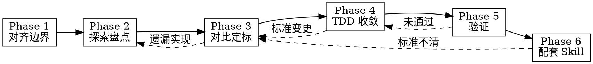

# Business Impl Unify

统一同一业务域的多套实现，降低分叉维护成本；收敛完成后为标准实现配套 Agent Skill。

## Overview

**核心原则：** 先盘点、再对比、后定标——**用户确认统一标准前不改代码**；收敛时行为对等、代码适配，禁止 1:1 复制粘贴；收尾用 `creating-skills-guided` 固化规范。

**产出：**

1. 业务域简报（Phase 1）
2. 实现清单 + 关系图（Phase 2）
3. 差异报告 + 统一标准提案（Phase 3）
4. 收敛后的代码（Phase 4）
5. 验证报告（Phase 5）
6. 配套 Agent Skill（Phase 6）

**内嵌能力：**

- Phase 2 → `gitnexus-exploring`（可用时）
- Phase 4 → `test-driven-development`
- Phase 5 → `verification-before-completion`
- Phase 6 → `creating-skills-guided`

## When to Use

- 用户显式调用（如 `/business-impl-unify`）
- 用户说「统一 XX 业务的实现」「这几套逻辑维护成本太高，收敛一下」
- 单仓内多模块、或跨仓存在同一业务的重复/分叉实现
- 收敛后需要把标准实现写成 Agent Skill 供团队复用

**When NOT to use:**

- 跨仓「迁移功能到另一项目」→ 用 `repo-feature-distill`
- 单点重构、非「多套同类实现」→ 用 `gitnexus-refactoring`
- 只分析不收敛、不写 Skill → 用 `gitnexus-exploring` + 报告
- 从零创建 Agent Skill（无业务收敛）→ 用 `creating-skills-guided`
- 蒸馏整应用 MVP → 用 `app-distill`

## Baseline Failures

| 失误 | 后果 |
|------|------|
| 跳过 Phase 1 直接改代码 | 业务边界不清，收敛范围失控 |
| 未确认统一标准就重构 | 团队不认可，二次分叉 |
| 1:1 复制某一实现覆盖其他 | 风格冲突、隐性依赖、回归 |
| 一次收敛多个无关业务 | 变更过大，无法验证 |
| 跳过验证就写配套 Skill | Skill 描述错误实现 |
| Phase 6 裸写 SKILL.md | 缺门禁与压测，Skill 质量不可控 |

## Six-Phase Pipeline

| Phase | 模块 | 产出 | 门禁 |
|-------|------|------|------|
| 1 | [phases/01-clarify.md](phases/01-clarify.md) | 业务域简报 | 用户确认 → Phase 2 |
| 2 | [phases/02-explore.md](phases/02-explore.md) | 实现清单 | 清单完整 → Phase 3 |
| 3 | [phases/03-standardize.md](phases/03-standardize.md) | 差异报告 + 统一标准 | 用户确认 → Phase 4 |
| 4 | [phases/04-converge.md](phases/04-converge.md) | 收敛代码 | 可测 → Phase 5 |
| 5 | [phases/05-verify.md](phases/05-verify.md) | 验证报告 | 通过 → Phase 6 |
| 6 | [phases/06-skillify.md](phases/06-skillify.md) | 配套 Skill 已部署 | 完成 |

<HARD-GATE>
Do NOT enter Phase 2 until the user explicitly approves the Phase 1 brief.
Do NOT enter Phase 4 until the user explicitly approves the Phase 3 standard proposal.
Do NOT enter Phase 6 until Phase 5 verification passes.
Do NOT write companion SKILL.md directly — invoke creating-skills-guided in Phase 6.
Do NOT unify more than one business domain per session.
When repos differ, move the agent to the appropriate workspace before reading or writing code.
</HARD-GATE>

## Execution Spine

1. **Announce:** "Using business-impl-unify, starting Phase 1: Clarify."
2. **Phase 1** → 业务域简报 → **wait for approval**
3. **Phase 2** → 实现清单（GitNexus 优先）→ 进入 Phase 3
4. **Phase 3** → 差异报告 + 统一标准 → **wait for approval**
5. **Phase 4** → TDD 收敛 → 进入 Phase 5
6. **Phase 5** → 验证报告 → 通过 → Phase 6
7. **Phase 6** → `creating-skills-guided` 部署配套 Skill

## Quick Reference

| 用户说 | 动作 |
|--------|------|
| 「统一订单业务的实现」 | Phase 1：单仓还是跨仓？成功标准？ |
| 「三套登录逻辑合并一套」 | Phase 2 盘点三套入口与调用链 |
| 「标准方案可以，开始改」 | Phase 4 |
| 「只要报告不要改代码」 | 停止于 Phase 3，不走本技能全流程 |
| 「收敛完帮我写个 Skill」 | Phase 6，走 creating-skills-guided |

## Red Flags — STOP

- 「很明显留 A 删 B，直接改」→ 回到 Phase 3
- 「先合并再补测试」→ 回到 Phase 4，先 TDD
- 「Skill 随便写一段就行」→ 回到 Phase 6
- 「顺便把支付也统一了」→ 回到 Phase 1，一次一域
- 「跨仓直接 copy 文件」→ 违反适配原则

## Additional Resources

- 差异报告模板：[templates/divergence-report.md](templates/divergence-report.md)
- 统一标准模板：[templates/standard-proposal.md](templates/standard-proposal.md)
- 示例触发语：[examples.md](examples.md)
