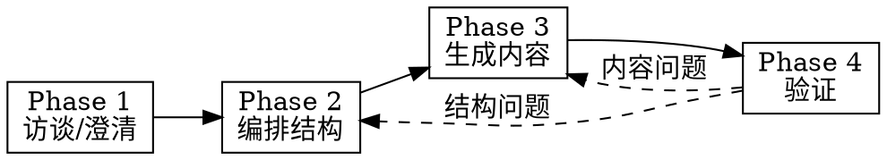

# Conversation to Article

将杂乱但高质量的对话，提炼为可共享的结构化文章。

## Overview

**核心原则：** 对话是原料，不是文章。先对齐意图，再编排结构，后生成正文，最后验证——四步缺一不可。

**产出：** 一篇可对外分享的文章（Markdown 或用户指定格式）。

## When to Use

- 对话中有深刻见解、独特框架，但顺序混乱、夹杂试错和闲聊
- 需要把技术/产品/思考讨论沉淀为博客、公众号、知识库文章
- 用户说「整理成文章」「提取精华」「对话转文章」

**When NOT to use:**

- 只需私人笔记归档 → 用 `conversation-to-obsidian`
- 对话内容太少（< 3 轮实质交流）→ 直接写短文，无需四阶段
- 用户只要摘要 bullet points → 不必走完整文章流程

## Baseline Failures (Why This Skill Exists)

无本技能时，Agent 常犯以下错误——本技能逐步封堵：

| 失误 | 后果 |
|------|------|
| 跳过澄清直接写 | 受众/调性/边界错误 |
| 按对话时间线复述 | 文章杂乱，不可读 |
| 过度压缩 | 丢失对话中的高质量洞见 |
| 全盘照搬 | 隐私、废话、重复一并发布 |
| 跳过结构直接写正文 | 逻辑跳跃，缺叙事弧 |
| 写完即交付 | 结构漏洞、事实错误未被发现 |

## Four-Phase Pipeline

| Phase | 模块 | 产出 | 门禁 |
|-------|------|------|------|
| 1 | [phases/01-clarify.md](phases/01-clarify.md) | 文章意图简报 | 用户确认后才能进入 Phase 2 |
| 2 | [phases/02-orchestrate.md](phases/02-orchestrate.md) | 大纲 + 素材映射表 | 用户确认后才能进入 Phase 3 |
| 3 | [phases/03-deliver.md](phases/03-deliver.md) | 文章初稿 | 自动进入 Phase 4 |
| 4 | [phases/04-review.md](phases/04-review.md) | 验证报告 + 终稿 | 通过后交付；不通过则回流 |

<HARD-GATE>
Do NOT enter Phase 2 until the user explicitly approves the Phase 1 brief.
Do NOT enter Phase 3 until the user explicitly approves the Phase 2 outline.
Do NOT declare the article complete until Phase 4 verification passes.
</HARD-GATE>

## Execution Spine

1. **Announce:** "Using conversation-to-article skill, starting Phase 1: Clarify."
2. **Read** the full conversation context available in the session.
3. **Run Phase 1** → present brief → **wait for approval**.
4. **Run Phase 2** → present outline + material map → **wait for approval**.
5. **Run Phase 3** → generate draft.
6. **Run Phase 4** → verify → fix issues → deliver final article.

## Quick Reference

| 用户说 | 动作 |
|--------|------|
| 「把这段对话写成文章」 | 从 Phase 1 开始 |
| 「大纲可以，写吧」 | 进入 Phase 3 |
| 「第 2 节太弱」 | Phase 4 回流 → 改结构或内容 |
| 「只要技术部分」 | Phase 1 明确范围后重新编排 |
| 「语气太正式」 | Phase 1 修正调性 → 回流 Phase 3 |

## Common Mistakes

| 错误 | 修复 |
|------|------|
| 把对话流水账当文章 | Phase 2 必须重组叙事，禁止按时间线堆砌 |
| 丢失对话中的金句/框架 | Phase 2 素材映射表逐项标注来源 |
| 泄露隐私或内部信息 | Phase 1 确认脱敏边界；Phase 4 检查 |
| 用户没确认就写正文 | 严格遵守 HARD-GATE |
| 验证流于形式 | Phase 4 必须逐项勾选检查清单 |

## Red Flags — STOP

- 「对话够清楚了，直接写」
- 「先出个草稿再调整结构」
- 「全部内容都保留」
- 「验证太麻烦，差不多就行」

**以上任一出现，回到对应 Phase 重新执行。**
