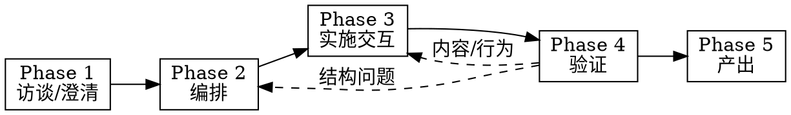

# Creating Skills Guided

通过「访谈 → 编排 → 实施 → 验证 → 产出」五阶段，把想法变成可部署的 Agent Skill。

## Overview

**核心原则：** 技能不是一次性写出的文档，而是经用户对齐、结构审批、压测验证后的可复用资产。

**产出：** 部署到正确路径的 `skill-name/SKILL.md`（及可选附属文件）。

**内嵌能力：**

- Phase 3 实施 → 遵循 `create-skill` 的结构与路径规范
- Phase 4 验证 → 遵循 `writing-skills` 的 TDD 压测与 CSO 规范

## When to Use

- 用户要从零创建新技能，且希望分步确认
- 已有工作流/对话经验，需蒸馏为 SKILL.md
- 用户明确说「引导式创建技能」「先澄清再写技能」
- `create-skill` 或 `writing-skills` 单独使用时常跳过用户对齐或压测

**When NOT to use:**

- 只修改技能的一两个段落 → 直接编辑，走 `writing-skills` 增量测试
- 机械性一次性操作 → 不必五阶段
- 项目级规则/约定 → 用 `create-rule` 或 `AGENTS.md`

## Baseline Failures

| 失误 | 后果 |
|------|------|
| 跳过澄清直接写 SKILL.md | 触发条件错误、scope 过大 |
| 无结构蓝图，堆进单文件 | 超 500 行、难维护、难发现 |
| description 写流程摘要 | Agent 跳过正文（CSO 陷阱） |
| 不做压测就部署 | 高压下 Agent 不遵守门禁 |
| 写入 `skills-cursor/` | 被系统覆盖或不可控 |
| 用户未确认就创建文件 | 返工成本高 |

## Five-Phase Pipeline

| Phase | 模块 | 产出 | 门禁 |
|-------|------|------|------|
| 1 | [phases/01-clarify.md](phases/01-clarify.md) | 技能意图简报 | 用户确认 → Phase 2 |
| 2 | [phases/02-orchestrate.md](phases/02-orchestrate.md) | 结构蓝图 | 用户确认 → Phase 3 |
| 3 | [phases/03-deliver.md](phases/03-deliver.md) | SKILL.md 草案 + 附属文件 | 展示后 → Phase 4 |
| 4 | [phases/04-review.md](phases/04-review.md) | 验证报告 | 通过 → Phase 5 |
| 5 | [phases/05-deploy.md](phases/05-deploy.md) | 已部署技能 | 告知路径与用法 |

<HARD-GATE>
Do NOT enter Phase 2 until the user explicitly approves the Phase 1 brief.
Do NOT create or write skill files until the user explicitly approves the Phase 2 blueprint.
Do NOT deploy until Phase 4 verification passes.
Do NOT create the next skill in the same session until the current skill is deployed and verified.
</HARD-GATE>

## Execution Spine

1. **Announce:** "Using creating-skills-guided, starting Phase 1: Clarify."
2. **Phase 1** → 技能意图简报 → **wait for approval**
3. **Phase 2** → 结构蓝图 → **wait for approval**
4. **Phase 3** → 按 `create-skill` 写文件，分步展示关键内容
5. **Phase 4** → 按 `writing-skills` 做文档检查 + 压测清单
6. **Phase 5** → 写入目标路径，报告部署结果

## Quick Reference

| 用户说 | 动作 |
|--------|------|
| 「帮我创建一个技能」 | Phase 1 开始 |
| 「结构可以，写吧」 | Phase 3 |
| 「description 太长」 | Phase 4 回流 Phase 3 |
| 「放个人技能库」 | Phase 1 记 `~/.cursor/skills/` |
| 「放项目里」 | Phase 1 记 `.cursor/skills/` |

## Red Flags — STOP

- 「需求很清楚，直接写 SKILL.md」
- 「先写草稿再补结构」
- 「description 里写上完整流程方便发现」
- 「测试以后再说」
- 「先批量创建几个技能」

**出现以上任一，回到对应 Phase。**

## Additional Resources

- 文章化同类流程参考：`conversation-to-article`（四阶段门禁模式）
- 分类规范参考：`~/.agents/skills/SKILL-TAXONOMY.md`
