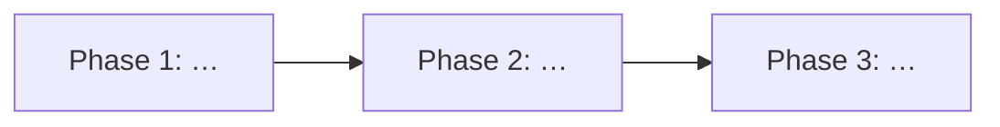

# <Feature Title> — Roadmap

> **Feature slug:** `<YYYY-MM-DD>-<feature-slug>`
> **Requirements root:** `docs/requirements/<feature-slug>/`
> **Status:** Phase 0 complete — ready for per-Phase brainstorming

## Overview

<!-- 2–3 句话：业务目标、涉及平台、主流程 -->

## Phase Dependency

## Git 策略（方案 A：同目录切分支）

> Phase 0 预填；各 Phase **开始写代码前** 执行 Step 0。不用 worktree。

| Repo | Branch | Base | 状态 |
|------|--------|------|------|
| `panasonic` | `feature/<feature-slug>` | master | 待创建 |
| `digital-mobile-h5` | `feature/<feature-slug>` | master | 待创建 |
| `cool-front-micro-base` | `feature/<feature-slug>` | master | 待创建 |

Step 0：`git fetch` → `checkout master` → `pull` → `checkout -b feature/<slug>` → 报告当前分支。

## Phases

### Phase 1: <名称>

- **Goal:** <!-- 一句话，可验收 -->
- **Repos:** `panasonic` | `digital-mobile-h5` | `cool-front-micro-base`
- **PRD 章节:** §…
- **视觉参考:**
  - `assets/<file>.png`
- **API 参考:** `api.md` §…
- **Out of scope:** …
- **Depends on:** —

### Phase 2: <名称>

- **Goal:**
- **Repos:**
- **PRD 章节:**
- **视觉参考:**
  - `assets/<file>.png`
- **API 参考:**
- **Out of scope:**
- **Depends on:** Phase 1

<!-- 复制 Phase 块直至联调 Phase -->

### Phase N: 联调与冒烟

- **Goal:** dev 环境验收 L1 展示类断言
- **Repos:** 全部
- **视觉参考:** —
- **API 参考:** `api.md` 全量
- **Out of scope:** 生产部署、造数脚本（除非 plan 单列）
- **Depends on:** Phase N-1

## Open Questions

| # | 问题 | 阻塞 Phase | 状态 |
|---|------|-----------|------|
| 1 | … | Phase 2 | 待产品确认 |

## Spec / Plan 索引（Phase N 完成后填写）

| Phase | Spec | Plan | Branch |
|-------|------|------|--------|
| 1 | — | — | — |
