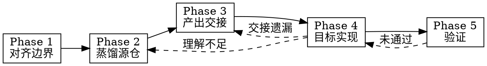

# Repo Feature Distill

从源代码仓库蒸馏指定功能的实现知识，产出结构化交接文档，并在目标仓库分阶段实现类似功能。

## Overview

**核心原则：** 理解 → 蒸馏 → 交接 → 适配实现。行为对等，代码适配——禁止 1:1 复制粘贴。

**产出：**

1. 功能边界简报（Phase 1）
2. 蒸馏报告（Phase 2）
3. 结构化交接文档 + Canvas 架构图（Phase 3）
4. 目标仓库实现（Phase 4）
5. 验证报告（Phase 5）

**内嵌能力：**

- Phase 2 → GitNexus 探索工作流（见 `02-distill.md`）
- Phase 3 → 固定交接模板（见 `templates/handoff-template.md`）
- Phase 4 → 目标仓库风格适配规则

## When to Use

- 用户显式调用（如 `/repo-feature-distill`）
- 用户说「从 A 仓库蒸馏 X 功能到 B 仓库」
- 用户说「迁移/复刻/移植某功能到另一个项目」
- 用户需要在跨语言/跨框架环境下复现源仓某功能

**When NOT to use:**

- 整仓迁移或全量复制 → 只做指定功能
- 只分析源仓库、不需要目标侧落地 → 用 `gitnexus-exploring`
- 已有完整分析，只需生成开发提示词 → 用 `generate-dev-handoff-prompt`
- 单仓库内重构或新功能开发 → 用 `gitnexus-exploring` + 常规开发流程

## Baseline Failures

| 失误 | 后果 |
|------|------|
| 跳过 Phase 1 直接读代码 | 功能边界模糊，蒸馏范围失控 |
| 未确认蒸馏报告就写交接文档 | 遗漏核心流程或错误映射 |
| 1:1 复制源仓代码到目标仓 | 风格冲突、依赖不匹配、维护困难 |
| 跳过 Canvas 直接写长文描述架构 | 结构不清晰，交接文档难消化 |
| 在 Phase 3 同时开始写目标仓代码 | 交接文档不完整，实现偏离 |
| 跨语言移植时不写适配说明 | 直接照搬 API/模式导致编译或运行时失败 |

## Five-Phase Pipeline

| Phase | 模块 | 产出 | 门禁 |
|-------|------|------|------|
| 1 | [phases/01-clarify.md](phases/01-clarify.md) | 功能边界简报 | 用户确认 → Phase 2 |
| 2 | [phases/02-distill.md](phases/02-distill.md) | 蒸馏报告 | 用户确认 → Phase 3 |
| 3 | [phases/03-handoff.md](phases/03-handoff.md) | 交接文档 + Canvas | 用户确认 → Phase 4 |
| 4 | [phases/04-implement.md](phases/04-implement.md) | 目标仓库代码 | 展示后 → Phase 5 |
| 5 | [phases/05-verify.md](phases/05-verify.md) | 验证报告 | 通过 → 完成 |

<HARD-GATE>
Do NOT enter Phase 2 until the user explicitly approves the Phase 1 brief.
Do NOT enter Phase 3 until the user explicitly approves the Phase 2 distillation report.
Do NOT enter Phase 4 until the user explicitly approves the Phase 3 handoff document.
Do NOT mark the task complete until Phase 5 verification passes.
When source and target repos differ, move the agent to the appropriate workspace before reading or writing code.
</HARD-GATE>

## Execution Spine

1. **Announce:** "Using repo-feature-distill, starting Phase 1: Clarify."
2. **Phase 1** → 功能边界简报 → **wait for approval**
3. **Phase 2** → 蒸馏报告（GitNexus + 源码） → **wait for approval**
4. **Phase 3** → 交接文档 + Canvas 架构图 → **wait for approval**
5. **Phase 4** → 在目标仓库适配实现 → 展示变更
6. **Phase 5** → 验证报告 → 完成

## Quick Reference

| 用户说 | 动作 |
|--------|------|
| 「从 A 仓库蒸馏 auth 到 B」 | Phase 1 开始，收集两仓路径 |
| 「分析报告可以，写交接文档」 | Phase 3 |
| 「交接文档 OK，开始实现」 | Phase 4 |
| 「源仓是 Python，目标仓是 TS」 | Phase 1 标记跨语言，Phase 3 加适配专节 |
| 「只要分析，不要实现」 | 停止于 Phase 3，不走本技能全流程 |

## Red Flags — STOP

- 「功能很清楚，直接看代码写」→ 回到 Phase 1
- 「把源仓文件复制过去改改」→ 违反适配原则，回到 Phase 3
- 「跳过交接文档，直接在目标仓写」→ 回到 Phase 3
- 「整仓迁移」→ 回到 Phase 1 收窄范围
- 「description 里写清流程就行」→ CSO 陷阱，正文含门禁

## Additional Resources

- 交接文档模板：[templates/handoff-template.md](templates/handoff-template.md)
- 分类规范：`~/.agents/skills/SKILL-TAXONOMY.md`
